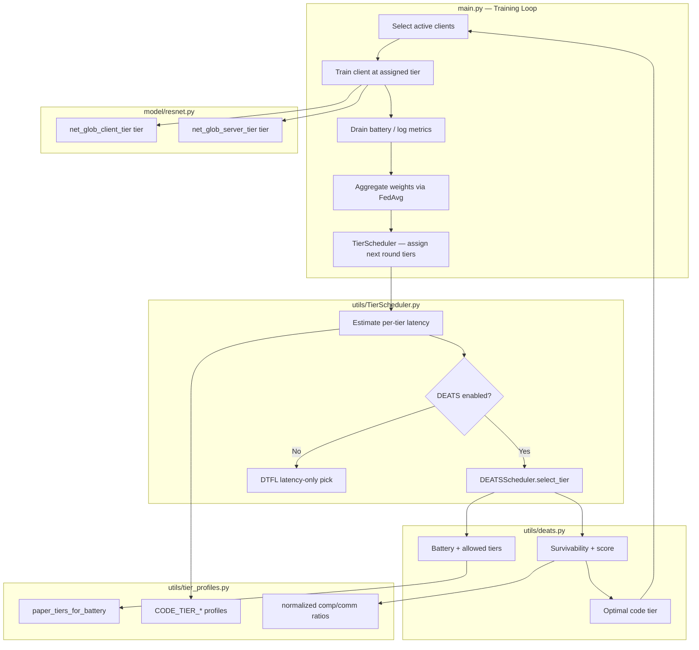

# Dynamic Tiering and Battery-Aware Scheduling (DEATS)

**Document purpose:** This chapter-style note describes only the **tiering and battery consumption** parts of the RAPET/DTFL implementation. It is written for inclusion in a thesis paper (Section 3.3 and related methodology). Privacy, noise injection, and other components are intentionally excluded.

**Project context:** Resource-Adaptive Privacy-Energy Tiering (RAPET) extends Dynamic Tiering-based Federated Learning (DTFL) with **Dynamic Energy-Aware Tier Scheduling (DEATS)**. DTFL decides *where* to split the neural network between client and server based on latency. DEATS adds *battery level*, *energy cost*, and *fairness* so that devices do not drop out mid-training and workload is not always pushed onto the same clients.

---

## 1. Problem Being Solved

In split federated learning, each client runs part of a ResNet model locally and sends intermediate activations (“smashed data”) to the server. The **split depth** is called a **tier**:

- **Deep tier (paper tiers 5–7):** more layers on the client → richer features, higher compute and battery cost, less server work.
- **Shallow tier (paper tiers 1–2):** fewer layers on the client → lighter device load, more work offloaded to the server.

Original DTFL assigns tiers using **latency only** (training time + communication delay). That ignores battery. In long runs (e.g. 300 FL rounds), weak or low-battery clients can hit a **5% safety floor** and stop participating. When several of eight clients drop permanently, the global model loses class diversity (non-IID HAM10000 shards) and **test accuracy falls**, even though training may still complete.

DEATS addresses this by:

1. Tracking simulated battery per client each round.
2. Restricting tier choices when battery is low.
3. Estimating energy cost and survivable rounds per tier.
4. Scoring tiers by **time + energy + fairness**.
5. Allowing **recharge while idle** so dropout is temporary, not permanent.

---

## 2. High-Level Architecture



**Core files (tiering only):**

| File | Role |
|------|------|
| `main.py` | Orchestrates FL rounds, client training, battery drain/recharge, calls `TierScheduler`, maps tiers to models |
| `utils/TierScheduler.py` | DTFL latency estimation + tier assignment entry point |
| `utils/deats.py` | Battery simulation, EMA energy, survivability, scoring, tier selection |
| `utils/tier_profiles.py` | Tier constants, paper/code conversion, battery-to-tier mapping |
| `model/resnet.py` | Seven ResNet split variants (client + server per tier) |
| `utils/fedavg.py` | Weighted aggregation across participating clients (supports variable participation after dropout/rejoin) |

---

## 3. Tier Numbering: Code vs Thesis

The codebase and the thesis report use **opposite numbering** for display. This is documented in `utils/tier_profiles.py`.

| Concept | Code tier (internal) | Paper / thesis tier |
|---------|---------------------|---------------------|
| Deepest client split (most local compute) | **1** | **7** |
| Shallowest client split (most server offload) | **7** | **1** |

**Conversion functions:**

- `code_tier_to_paper(code_tier, num_tiers) = num_tiers - code_tier + 1`
- `paper_tier_to_code(paper_tier, num_tiers) = num_tiers - paper_tier + 1`

**Logging in W&B:** `main.py` logs thesis-style tier as:

```python
num_tiers - client_tier[idx] + 1
```

So when you see `Client0_Tier = 7` in charts, that is the **deepest** split in paper notation.

**Model splits:** For ResNet-110 with seven tiers (`resnet110_SFL_local_tier_7` in `model/resnet.py`):

- Code tier **1:** client holds six ResNet blocks; server holds none (all client-side).
- Code tier **7:** client holds zero blocks; server holds all six blocks (maximum offload).

Each tier has a matching pair: `net_glob_client_tier[i]` and `net_glob_server_tier[i]`.

---

## 4. Heterogeneous Environment Simulation

Before tiering runs, `main.py` assigns each client a **network profile** and **compute profile** to mimic cross-device FL (as in the DTFL paper deployment description).

**Network speed** (`net_speed_list`, default Mbps values scaled to bytes/s):

```python
net_speed_list = [100, 30, 30, 30, 10]  # repeated for num_clients
```

**Compute delay coefficient** (weaker CPU → higher coefficient):

```python
delay_coefficient_list = [16, 20, 34, 130, 250] / 14.5
```

**Simulated round delay** (`compute_delay`):

\[
\text{total\_delay} = \frac{\text{data\_transmitted}}{\text{net\_speed}} + \text{duration} \times \text{delay\_coefficient}
\]

This delay history feeds `TierScheduler` so latency estimates reflect each client’s observed behavior, not a single global assumption.

**Initial tier assignment:** All clients start at code tier `num_tiers` (7), i.e. shallowest client workload in code terms, before the scheduler adapts per round.

---

## 5. Tier Profile Constants (`utils/tier_profiles.py`)

These values come from DTFL Appendix B (normalized training times) and measured split characteristics.

### 5.1 Normalized time ratios (paper tiers 1–7)

| Paper tier | Client time (×) | Server time (×) |
|------------|-----------------|-----------------|
| 1 | 1.00 | 1.00 |
| 2 | 1.63 | 0.82 |
| … | … | … |
| 7 | 4.33 | 0.10 |

Used in DEATS as `normalized_comp_ratio()` and `normalized_comm_ratio()` for energy scaling.

### 5.2 Per-tier code profiles

- **`CODE_TIER_DATA_SIZE`:** smashed-data / transmission size per tier (bytes).
- **`CODE_TIER_CLIENT_PROFILE`:** relative client compute cost.
- **`CODE_TIER_SERVER_PROFILE`:** relative server-side cost.

`TierScheduler._estimate_tier_times()` uses these to predict completion time if a client switched to tier `m`.

### 5.3 Battery-to-tier mapping (Table 3.1 in thesis)

Implementation in `paper_tiers_for_battery()` — **note:** thresholds were tuned in code to protect devices earlier than the original report text (30% → **45%**):

| Battery level B | Allowed paper tiers | Allowed code tiers (M=7) | Interpretation |
|-----------------|---------------------|-------------------------|----------------|
| B > 70% | 5–7 | 1–3 | Deep / heavy client compute allowed |
| 45% < B ≤ 70% | 3–4 | 3–5 | Medium split |
| B ≤ 45% | 1–2 | 5–7 | Shallow / light client compute |

Low-battery clients cannot be assigned deep tiers even if latency would favor them.

---

## 6. DTFL Latency-Based Tiering (`utils/TierScheduler.py`)

When DEATS is disabled (`--no_deats`), tier assignment is **latency-only**, following DTFL.

### 6.1 Steps each FL round (after training)

1. **Update computation history**  
   For each client `k`, subtract communication time from last observed delay to get compute time; append to `computation_time_clients[k]`.

2. **Build tier-specific history**  
   `client_time_tier()` collects past compute times grouped by `(client, tier)`.

3. **Estimate time for every candidate tier**  
   `_estimate_tier_times()` extrapolates from current tier’s smoothed compute time (EMA span=2) and profile ratios:

   \[
   T_m = \max(T_{\text{client},m}, T_{\text{server},m})
   \]

4. **Select tier (DTFL mode)**  
   `index_of_greatest_smaller()` picks the **deepest** tier whose estimated time ≤ `T_max` (global synchronization bound).

5. **Update T_max**  
   Set to the maximum of each client’s minimum achievable tier time — slowest client sets the pace.

### 6.2 With DEATS enabled

Steps 1–3 are identical. Step 4 delegates to `deats_scheduler.select_tier()` instead of pure latency pick. Dead clients (battery dropout) are assigned shallow fallback tier `num_tiers` for bookkeeping but do not train until revived.

---

## 7. DEATS: Dynamic Energy-Aware Tier Scheduling (`utils/deats.py`)

DEATS implements thesis Section 3.3 (Equations 3.1–3.6) on top of DTFL time estimates.

### 7.1 Configuration (`DEATSConfig`)

| Parameter | Default | Meaning |
|-----------|---------|---------|
| `ema_alpha` | 0.3 | EMA smoothing for observed energy (Eq. 3.1) |
| `energy_comp_weight` | 0.7 | Weight of compute in energy ratio (Eq. 3.2) |
| `energy_comm_weight` | 0.3 | Weight of communication in energy ratio |
| `score_time_weight` | 0.30 | Weight of latency in tier score (Eq. 3.5) |
| `score_energy_weight` | 0.35 | Weight of predicted energy in tier score |
| `score_fairness_weight` | 0.35 | Weight of fairness penalty in tier score |
| `battery_min` | 5.0 | Hard safety floor (%) — Eq. 3.4 |
| `energy_scale` | **0.004** | Scales raw compute/comm load to % battery drain per round |
| `battery_init_min` | 65.0 | Minimum starting battery (%) |
| `battery_init_max` | 100.0 | Maximum starting battery (%) |
| `recharge_rate_per_skipped_round` | 6.0 | % battery gained per idle (skipped) round |
| `revive_margin` | 10.0 | Client rejoins when battery ≥ `battery_min + revive_margin` (15%) |

CLI mirrors these via `--deats_*` arguments in `main.py`.

Fairness weights were increased from the initial 0.4/0.4/0.2 split so that one high-resource client is not repeatedly assigned the heaviest tier.

### 7.2 Battery simulator (`BatterySimulator`)

**Initialization:** Each client gets a random battery in `[battery_init_min, battery_init_max]`.

**Per training round — `drain()`:**

1. Compute instantaneous energy `E_t` via `_instantaneous_energy()`:

   \[
   \text{raw} = \text{duration} \cdot \text{delay\_coefficient} \cdot s + \frac{\text{data\_transmitted}}{\text{net\_speed}} \cdot s
   \]

   where `s = energy_scale`, then multiply by tier energy ratio (Eq. 3.2).

2. Subtract drain from battery (capped by usable charge above floor).

3. If battery ≤ `battery_min`, clamp to floor and set `dropout = True`.

**Idle rounds — `recharge_idle()` (implementation enhancement):**

When a client is skipped at the floor, it gains `recharge_rate_per_skipped_round` per round. When battery reaches **15%**, `dropout` is cleared and the client **rejoins**. This models charging between participation windows and prevents permanent loss of a client’s data shard for the rest of training.

### 7.3 EMA energy rate (Eq. 3.1)

After each drain:

```text
EMA_t = α · E_t + (1 − α) · EMA_{t−1},   α = 0.3
```

First observation initializes EMA directly.

### 7.4 Per-round energy estimate (Eq. 3.3)

```text
E_round[m] = EMA_k · energy_ratio[m]
```

If no EMA history yet, bootstrap `ema = 0.3` (calibrated to small `energy_scale`).

`energy_ratio[m]` combines normalized compute and communication ratios for paper tier `m`.

### 7.5 Survivability prediction (Eq. 3.4)

```text
rounds_survive = (B − B_min) / E_round[m]
```

Used as a **filter**: tiers that cannot survive the planning horizon are excluded.

**Lookahead window (important implementation detail):**

```python
lookahead = min(remaining_rounds, 30)
```

The scheduler checks survivability for the **next ~30 rounds**, not all remaining rounds (e.g. 299 at round 1). Requiring survival for the entire campaign would force almost every client into fallback tiers and disable meaningful scoring. The horizon is re-evaluated every round with fresh battery readings (**receding-horizon planning**).

### 7.6 Fairness deviation

`record_relative_energy()` stores each client’s relative drain (`energy_drain / battery`).

`fairness_deviation()` penalizes tiers that would make a client consume much more relative energy than peers:

```text
F = (predicted_relative − mean_peer_relative)²
```

### 7.7 Combined score and tier selection (Eq. 3.5–3.6)

For each feasible tier `m`:

```text
Score[k][m] = w_T · T_m + w_E · E_round[m] + w_F · F
```

Select `m` with **minimum** score. Additional filters:

- Tier must be in battery-allowed set.
- Estimated time ≤ `T_max` (if provided).
- Survivable rounds ≥ `lookahead`.

If no tier passes, **survivability fallback:** shallowest allowed tier.

---

## 8. Integration in `main.py` (Per-Round Workflow)

The following describes one federated round when DEATS is enabled (`--use_deats`, default).

### Phase A — Start of round

1. Optionally update privacy noise schedule (not tier-related).
2. Build lists:
   - `active_idxs_users`: clients with `is_alive() == True`
   - `dropped_idxs_users`: clients at battery floor

### Phase B — Handle dropped clients

For each dropped client:

- Log skip message and W&B metrics (`ClientX_DroppedOut`, `ClientX_Battery`).
- Call `recharge_idle(idx)` to simulate charging.

Set `m = len(active_idxs_users)` for federation bookkeeping (only active clients count toward round completion).

If `m == 0`, skip the round safely.

### Phase C — Train active clients

For each `idx` in `active_idxs_users`:

1. Log `Client{idx}_Tier` (paper notation).
2. Load client model: `net_model_client_tier[client_tier[idx]]`.
3. Run local training → server-side backward via split learning.
4. Collect weights into `w_locals_client_tier[client_tier[idx]]`.
5. Accumulate simulated delay via `compute_delay()`.
6. **Battery update:**
   - `drain(...)` with duration, data size, net speed, delay coefficient, current tier.
   - `update_ema()` and `record_relative_energy()`.
   - Log battery, drain, EMA to W&B.

### Phase D — Aggregation

- `calculate_client_samples()` weights by shard size for **active** clients only.
- `aggregated_fedavg()` in `utils/fedavg.py` merges client/server contributions; divides by `sum(client_sample)` so partial participation is handled correctly.

### Phase E — Schedule next round’s tiers

Call `TierScheduler(...)` with:

- `delay_history` = historical simulated delays
- `client_tier_all` = full tier history
- `deats_scheduler` and `remaining_rounds = epochs - iter - 1`

Update `client_tier` dict and assign `net_model_server_tier[i]` for each client.

---

## 9. Connection to Model and Aggregation

### 9.1 Multi-tier models

`main.py` builds seven client models and seven server models:

```python
for i in range(1, num_tiers + 1):
    net_glob_client_tier[i], net_glob_server_tier[i] = SFL_local_tier(classes=class_num, tier=i)
```

Each client uses the model slice matching its **current** `client_tier[idx]`. Server-side training in `train_server()` uses `net_model_server_tier[idx]`.

Weights are aggregated into a global model, then copied back into all tier variants (shared backbone layers; tier-specific heads handled in aggregation logic).

### 9.2 FedAvg and tiering

`utils/fedavg.py` does not perform tier selection; it ensures that when different clients participate in different rounds (due to recharge cycles), **only participating clients’ weights** are averaged with correct sample weighting. This stabilizes accuracy when DEATS causes intermittent rather than permanent absence.

---

## 10. Problems Identified During Development and Fixes Applied

This section documents engineering changes relevant to tiering/battery behavior (for thesis “implementation challenges” or “refinements”).

| Issue | Symptom | Fix |
|-------|---------|-----|
| Federation counted dropped clients | Server metrics stopped updating mid-run; federation waited for clients that never completed | Use `active_idxs_users` and `m = len(active_idxs_users)` |
| `energy_scale` too high (0.15, then 0.03) | Clients 2,3,4,6,7 hit 5% floor early; test accuracy ~66% | Recalibrate to **0.004**; raise `battery_init_min` to **65%** |
| Permanent dropout | Once `dropout=True`, client never returned; lost class shards | **`recharge_idle()`** + revive at 15% battery |
| Survivability required all remaining rounds | DEATS scoring empty from round 1; always fallback tier | **`lookahead = min(remaining_rounds, 30)`** |
| Low battery protection too late | Report used 30% threshold; devices still stressed | Code uses **45%** threshold for shallow tiers |
| Unfair tier load | Same strong clients always on heavy tiers | Increase **`score_fairness_weight`** to 0.35 |
| Evaluation on wrong client | Test skipped when last sampled client was dropped | Evaluate on **`active_idxs_users[-1]`** |

---

## 11. Logging and Experimental Verification (Tiering/Battery)

W&B metrics useful for thesis figures:

| Metric | Meaning |
|--------|---------|
| `Client{i}_Tier` | Assigned tier (paper notation) per round |
| `Client{i}_Battery` | Simulated battery % |
| `Client{i}_EnergyDrain` | Drain last round (%) |
| `Client{i}_EMA_Energy` | Smoothed energy rate |
| `Client{i}_DroppedOut` | 1 if skipped this round |
| `Client{i}_Total_Delay` | Simulated latency |
| `Active_Clients` | Count training this round |
| `max_time` | Updated `T_max` from scheduler |

**Success criteria for DEATS experiments:**

1. No client permanently excluded (revive messages in logs).
2. `Active_Clients` remains high in late rounds (e.g. ≥ 6 of 8).
3. Test accuracy stable or improved vs permanent-dropout runs.
4. Tier assignments vary with battery and fairness, not fixed on one client.

---

## 12. How to Run (Tiering-Related Flags)

```bash
# DEATS enabled (default)
python main.py --rounds 300 --use_deats

# DTFL baseline (latency only, no battery)
python main.py --rounds 300 --no_deats

# Optional overrides
python main.py \
  --deats_energy_scale 0.004 \
  --deats_battery_min 5.0 \
  --deats_battery_init_min 65.0 \
  --deats_battery_init_max 100.0 \
  --deats_ema_alpha 0.3
```

---

## 13. Alignment with Thesis Report (Section 3.3)

The implementation follows the report’s DEATS equations and workflow:

- Battery-aware tier assignment (Table 3.1) ✓  
- EMA energy tracking (Eq. 3.1) ✓  
- Energy ratio and per-round cost (Eq. 3.2–3.3) ✓  
- Survivability prediction (Eq. 3.4) ✓  
- Combined score (Eq. 3.5–3.6) ✓  
- Safety floor at 5% ✓  

**Documented implementation refinements** (should be stated explicitly in the thesis):

1. **Battery mapping threshold:** code uses **45%** (not 30%) for medium/low boundary to trigger shallow tiers earlier.
2. **Recharge/revive:** devices recharge while idle; dropout is **temporary**. This extends Section 3.3.6 (“graceful degradation”) and matches real devices that plug in between sessions.
3. **Receding horizon:** survivability checked over **30 rounds**, not full remaining training.
4. **Energy scale calibration:** `energy_scale = 0.004` chosen so simulated drain is compatible with 300-round campaigns on heterogeneous profiles.

---

## 14. Summary (One Paragraph for Thesis)

Dynamic tiering in this project combines **DTFL latency-aware split selection** with **DEATS battery-aware scheduling**. Each federated round, the system measures client delay and compute history, estimates completion time for all seven ResNet split points, and assigns each client a tier that balances synchronization time (`T_max`), predicted energy drain, and fairness across devices. Battery level restricts which tiers are legal; survivability over a short lookahead removes tiers that would exhaust the device; a weighted score chooses the best remaining tier. Simulated battery drains with tier-dependent compute and communication cost; clients hitting the 5% floor pause, recharge while idle, and rejoin when safe. This design keeps all heterogeneous clients contributing throughout long training, preserves non-IID class coverage, and implements the energy-fair dynamic tiering objective of RAPET without relying on latency alone.

---

*Generated from project source: `main.py`, `utils/deats.py`, `utils/TierScheduler.py`, `utils/tier_profiles.py`, `utils/fedavg.py`, `model/resnet.py`, aligned with Thesis Report Section 3.3.*
